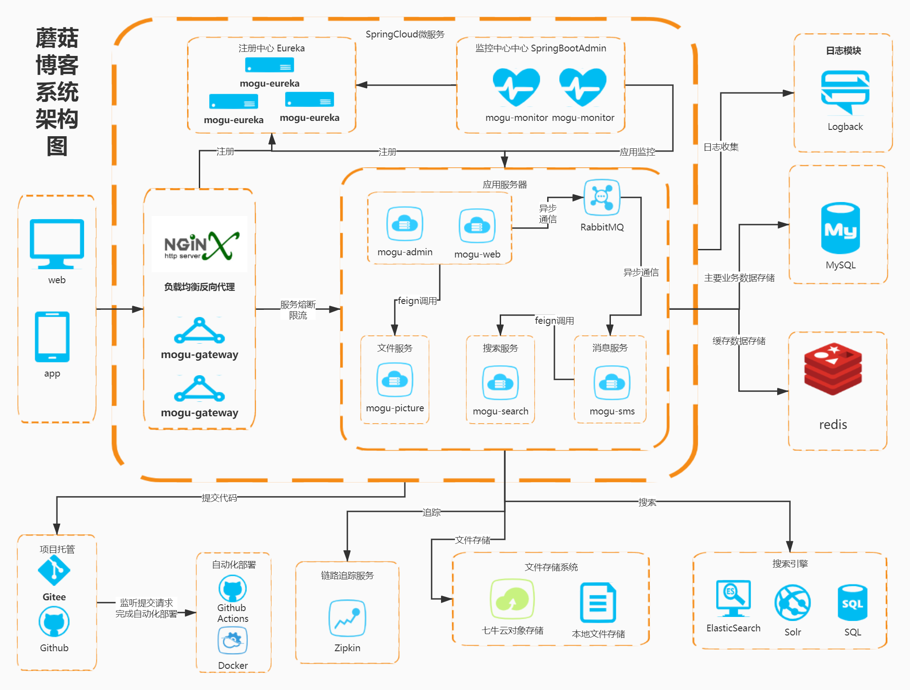

## 技术选型

### 系统架构图

### 后端技术

|      技术      |          说明           |                             官网                             |
| :------------: | :---------------------: | :----------------------------------------------------------: |
|   SpringBoot   |         MVC框架         | [ https://spring.io/projects/spring-boot](https://spring.io/projects/spring-boot) |
|  SpringCloud   |       微服务框架        |           https://spring.io/projects/spring-cloud/           |
| SpringSecurity |     认证和授权框架      |          https://spring.io/projects/spring-security          |
|  MyBatis-Plus  |         ORM框架         |                   https://mp.baomidou.com/                   |
|   Swagger-UI   |      文档生产工具       | [ https://github.com/swagger-api/swagger-ui](https://github.com/swagger-api/swagger-ui) |
|     Kibana     |    分析和可视化平台     |                                                              |
| Elasticsearch  |        搜索引擎         | [ https://github.com/elastic/elasticsearch](https://github.com/elastic/elasticsearch) |
|      Solr      |        搜索引擎         |                http://lucene.apache.org/solr/                |
|    RabbitMQ    |        消息队列         |   [ https://www.rabbitmq.com/](https://www.rabbitmq.com/)    |
|     Redis      |       分布式缓存        |                      https://redis.io/                       |
|     Docker     |       容器化部署        |      [ https://www.docker.com](https://www.docker.com/)      |
|     Druid      |      数据库连接池       | [ https://github.com/alibaba/druid](https://github.com/alibaba/druid) |
|     七牛云     |    七牛云 - 对象储存    |         https://developer.qiniu.com/sdk#official-sdk         |
|      JWT       |       JWT登录支持       |                 https://github.com/jwtk/jjwt                 |
|     SLF4J      |        日志框架         |                    http://www.slf4j.org/                     |
|     Lombok     |    简化对象封装工具     | [ https://github.com/rzwitserloot/lombok](https://github.com/rzwitserloot/lombok) |
|     Nginx      | HTTP和反向代理web服务器 |                      http://nginx.org/                       |
|    JustAuth    |    第三方登录的工具     |             https://github.com/justauth/JustAuth             |
|     Hutool     |     Java工具包类库      |                  https://hutool.cn/docs/#/                   |
|    阿里大于    |      短信发送平台       |            https://doc.alidayu.com/doc2/index.htm            |
| Github Actions |       自动化部署        |              https://help.github.com/en/actions              |
|     Zipkin     |        链路追踪         |             https://github.com/openzipkin/zipkin             |

### 前端技术

|         技术          |           说明            |                             官网                             |
| :-------------------: | :-----------------------: | :----------------------------------------------------------: |
|        Vue.js         |         前端框架          |                      https://vuejs.org/                      |
|      Vue-router       |         路由框架          |                  https://router.vuejs.org/                   |
|         Vuex          |     全局状态管理框架      |                   https://vuex.vuejs.org/                    |
|        Nuxt.js        | 创建服务端渲染 (SSR) 应用 |                    https://zh.nuxtjs.org/                    |
|        Element        |        前端ui框架         |    [ https://element.eleme.io](https://element.eleme.io/)    |
|         Axios         |       前端HTTP框架        | [ https://github.com/axios/axios](https://github.com/axios/axios) |
|        Echarts        |         图表框架          |                      www.echartsjs.com                       |
|       CKEditor        |       富文本编辑器        |                    https://ckeditor.com/                     |
|     Highlight.js      |     代码语法高亮插件      |         https://github.com/highlightjs/highlight.js          |
|      Tui-editor       |      Markdown编辑器       |              https://github.com/nhn/tui.editor               |
|      vue-cropper      |       图片裁剪组件        |           https://github.com/xyxiao001/vue-cropper           |
| vue-image-crop-upload |    vue图片剪裁上传组件    |      https://github.com/dai-siki/vue-image-crop-upload       |