# Windows环境下搭建蘑菇博客

## 前言

码云上最近有些小伙伴们问到了蘑菇博客的详细配置信息，突然想想之前本来打算写来着，但是因为各种各样的问题搁置了，现在就在win10环境下对博客的配置进行详细的说明了。

tip: 如遇到启动失败的,请先maven clean install 后再尝试启动

IDE得装lombok插件：[IDEA中引入Lombok](http://moguit.cn/#/info?blogUid=4ccb7df5d537f52d954eb15f094c90a3) 

参考：[蘑菇博客如何部署到阿里云服务器](http://www.moguit.cn/#/info?blogUid=89defe3f4a3f317cba9aa0cdb9ff879e) ，在你修改蘑菇博客源码后，将项目打包部署到云服务器

参考：[蘑菇博客切换搜索模式](http://moguit.cn/#/info?blogUid=4042b4f4088e4e37e95d9fc75d97298b)，完成蘑菇博客的搜索引擎切换，目前支持Solr、ElasticSearch、mysql的方式，一般因为服务器配置文件，选择一种搜索方式即可

参考：[蘑菇博客切换七牛云存储](http://moguit.cn/#/info?blogUid=735ed389c4ad1efd321fed9ac58e646b)，配置文件的七牛云对象存储，及本地文件存储

## 1、配置JDK

略

## 2、配置Maven

maven安装成功后，记得添加阿里源，不然有些东西下载会非常慢的

 

## 3、配置nginx

nginx的下载直接到nginx官网下载即可

下载完成后，我们需要修改nginx.conf配置文件，加入下面的内容

```bash
#蘑菇博客图片资源
server {
 listen       8600;
 server_name  localhost;	
 location / {
	root   D:\mogu_blog\data;
	index  index.html index.htm;
 }
}
```

就是将8600端口的请求映射到 D:\mogu_blog\data的目录下，如果没有这个目录的，可以提前创建好，当然不一定在D盘，可以在任意位置，其它位置修改成对应的即可。

不过如果需要修改的话，需要到mogu_picture项目的yml文件里也一起修改对应的配置文件，如下图的 file.upload.path 修改成自定义的即可

```bash
#Data image url
data:
  image:
    url: http://localhost:8600/
file:
  upload:
    path: D:/mogu_blog/data
```

 

## 4、配置redis

去redis官网，进行下载：https://redis.io/

然后双击启动即可

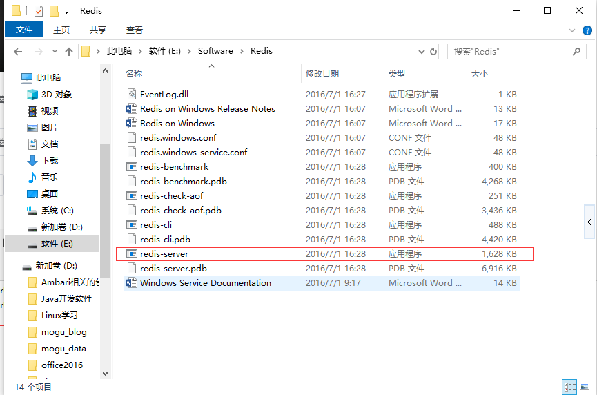

## 5、配置RabbitMq

RabbitMQ是一款比较优秀的消息中间件，在这里主要用于同步solr索引，redis缓存更新，以及邮件和验证码发送等功能。

关于配置，参考这篇博客：[蘑菇博客配置RabbitMQ](http://www.moguit.cn/#/info?blogUid=995e0fccd2b240aabd56a10a688e42d4)

 

## 6、配置搜索模块

目前蘑菇博客支持三种搜索模式的配置，分别是Solr、ElasticSearch和SQL，小伙伴可以按照自己的服务器配置进行相应的部署

参考：[蘑菇博客切换搜索模式](http://moguit.cn/#/info?blogUid=4042b4f4088e4e37e95d9fc75d97298b) ，进行三种模式的切换

### **配置Solr**

关于window下配置蘑菇博客的solr，其实和我之前写的一篇博客大同小异，在这里我就不多叙述了，详情参考：[CentOS下Solr的安装和部署](http://www.moguit.cn/#/info?blogUid=7c7404c456904be5b7736238f28d2515)

注意：需要修改schema.xml文件

最近很多小伙伴说solr不好配置，所以我特意把solr的上传到百度云和七牛云了，小伙伴只需要下载后，放到tomcat的webapps目录下，然后修改一下solrhome的配置即可

百度云：

```
链接：https://pan.baidu.com/s/1gpKs7oixT8RBn8zuDSiEGQ 
提取码：ditj 
```

七牛云：

```
http://image.moguit.cn/solr.zip
```

下载完成后，解压

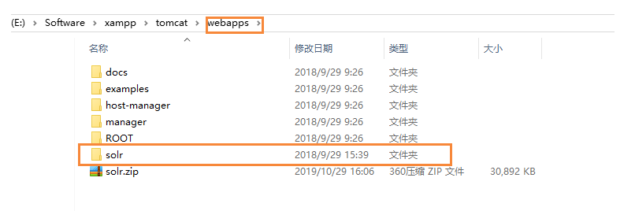

然后找到 web.xml文件

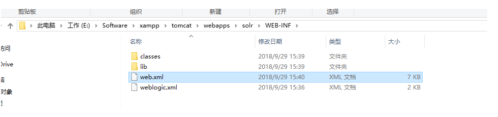

修改里面的地址，把路径改成你的目录即可

```
    <env-entry>
       <env-entry-name>solr/home</env-entry-name>
       <env-entry-value>E:\Software\xampp\tomcat\webapps\solr\solr_home</env-entry-value>
       <env-entry-type>java.lang.String</env-entry-type>
    </env-entry>
```

然后查看solr admin页面：http://localhost:8080/solr/#/

如果能正常显示，说明已经安装成功

 

### **配置ElasticSearch**

关于ElasticSearch的配置和相关介绍，可以参考这篇博客：[Elasticsearch介绍和安装](http://moguit.cn/#/info?blogUid=ee342088a5d0f5b96bcb4582d9b563aa)

window也可自行百度进行安装，或者直接下载我上传的压缩包

七牛云地址：

```
http://image.moguit.cn/ElasticSearch.zip
```

下载完后，解压能看到这个目录

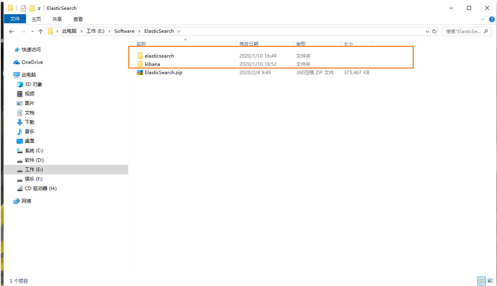

我们首先进入elasticsearch下的config目录，修改elasticsearch.yml文件，把下面两个路径，改成你对应的目录即可

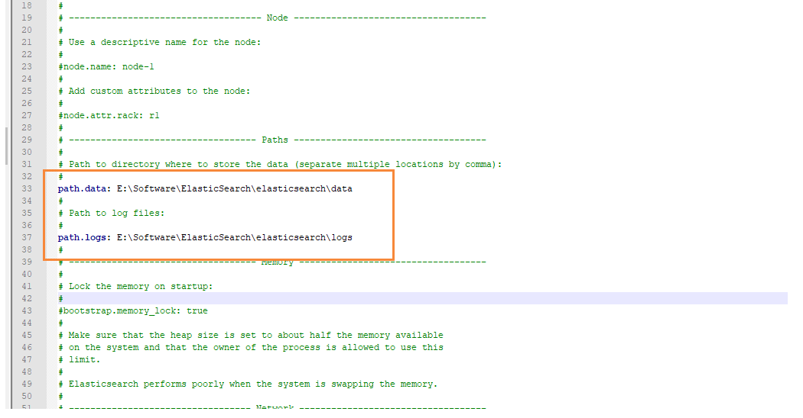

**然后启动ElasticSearch：**

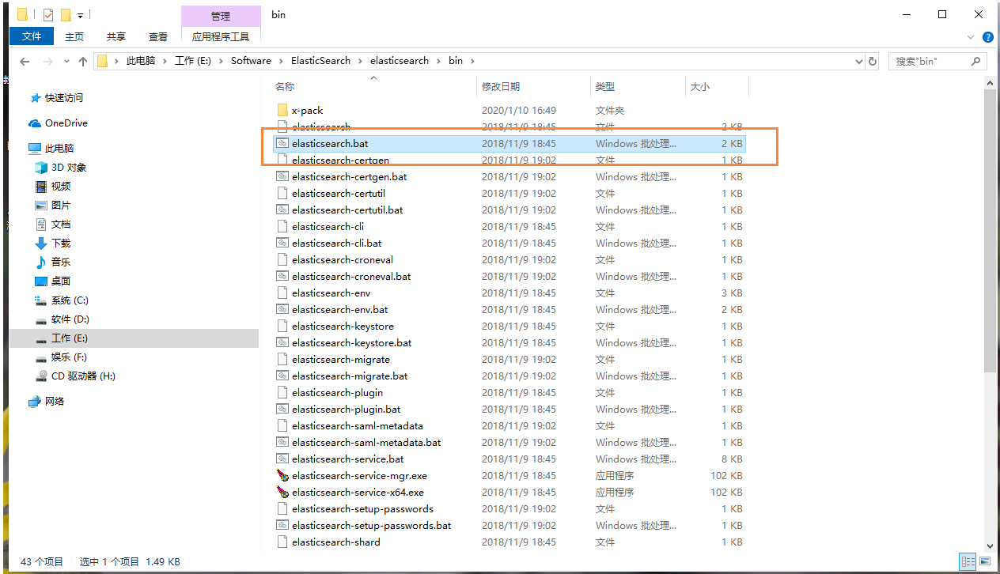

**启动Kibana：**

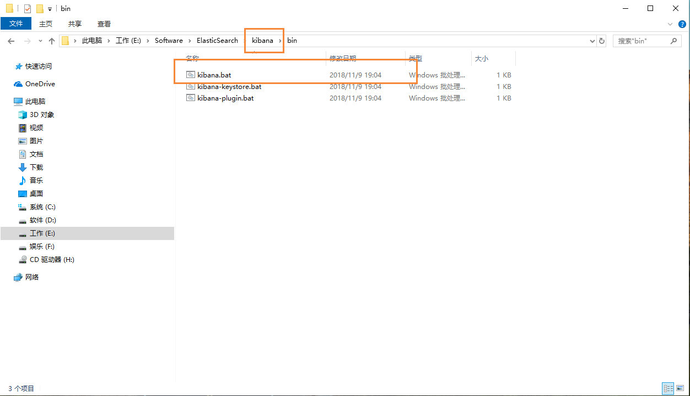

启动完成后：我们输入网址 

```
http://localhost:5601/
```

如果能出现下面的页面，说明已经成功安装了 ElasticSearch 和 Kibana，在这里kibana只是作为ElasticSearch的图形化显示工具，相当于原来的SolrAdmin页面一样，在生产环境中，可以不部署也行

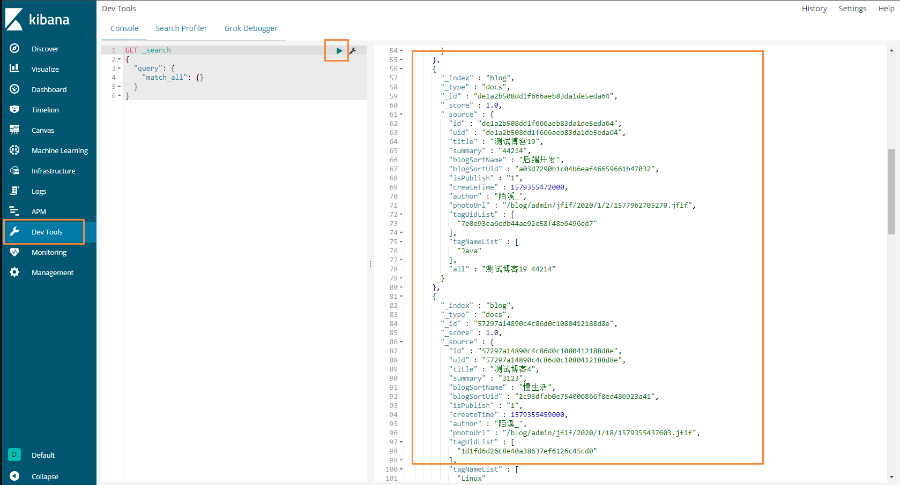

## 7、配置Mysql

```bash
# 使用命令把项目clone下来
git clone https://gitee.com/moxi159753/mogu_blog_v2.git
```

然后找到目录下的doc文件夹，里面有个数据库脚本，里面有两个数据库，我们需要提前创建好 mogu_blog 、mogu_picture 这里两个数据库，然后把备份脚本导入即可。

同时设置数据库访问账户和密码为： admin  admin

当然不设置也没关系，就是后面修改yml文件里面的配置即可

## 8、配置zipkin链路追踪

Zipkin是一个开源的分布式的链路追踪系统，每个微服务都会向zipkin报告计时数据，聚合各业务系统调用延迟数据，达到链路调用监控跟踪。

参考博客：[使用Zipkin搭建蘑菇博客链路追踪](http://www.moguit.cn/#/info?blogUid=35bd93cabc08611c7f74ce4564753ef9)

 

## 9、启动后端项目

在全部配置完成后，就可以开始启动项目了，这里我用的编辑器是sts。目前有热心的码云朋友说IDEA不能正常启动项目，后面我经过排查，确实是存在这个文件，最近正在研究是哪块出错导致的。目前蘑菇博客的开发已经迁移到 IDEA中了，感谢[Jetbrains全家桶](https://www.jetbrains.com/?from=mogu_blog_v2)对开源的支持~。

首先进入项目根目录文件夹，执行下面命令

```
# 下载依赖
mvn clean install
```

如果下面都是success，那就说明依赖下载成功了

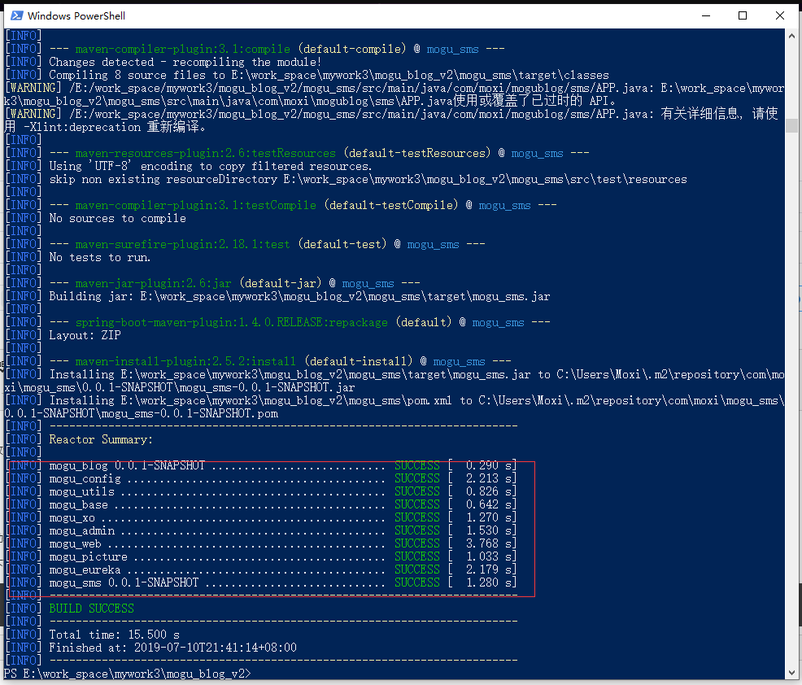

下面就把项目导入到sts中

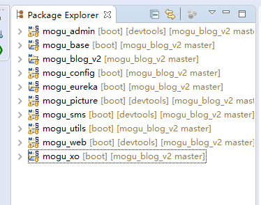

关于项目的介绍

```bash
1、MoguBlog 是一款基于最新技术开发的多人在线、简洁的博客系统。
2、mogu_admin: 是admin端API接口服务；
3、mogu_web: 是web端API接口服务；
4、mogu_eureka: 服务发现服务器；
5、mogu_picture: 图片服务器，用于图片上传和下载；
6、mogu_sms: 消息发送服务器，用于邮件和短信发送
7、mogu_utils: 是常用工具类；
8、mogu_xo: 是存放 Entity，Service，Dao层的
9、mogu_base: 是一些Base基类
10、mogu_config: 是存放一些配置
11、doc: 是蘑菇博客的一些文档和数据库文件
12、vue_mogu_admin：VUE的后台管理页面
13、vue_mogu_web：VUE的前台页面
```

 下面进行项目启动

mogu_eureka -> mogu_picture -> mogu_sts -> mogu_admin -> mogu_web， 下面是启动成功的图片

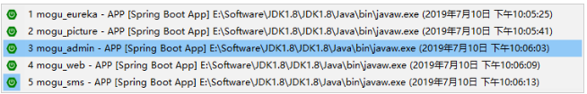

 

启动成功后，我们应该能够查看到对应的Swagger接口文档

```
# admin端swagger-ui.html
http://localhost:8601/swagger-ui.html

# picture端swagger-ui.html
http://localhost:8602/swagger-ui.html

# picture端swagger-ui.html
http://localhost:8602/swagger-ui.html
```

 

Admin端接口文档：

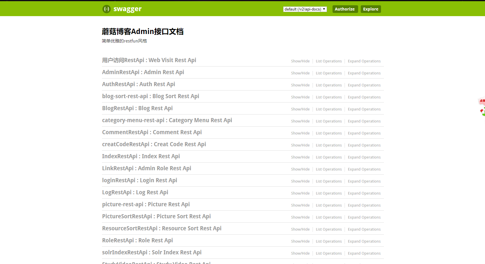

Picture端接口文档

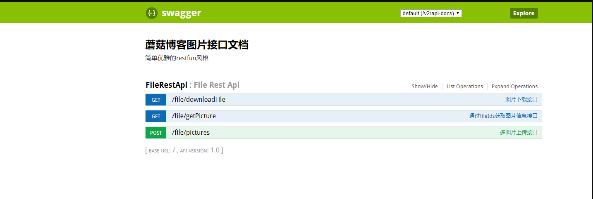

web端接口文档

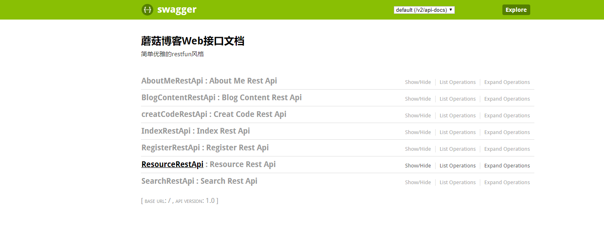

## 10、启动前端项目

前端项目使用的是Vue编写的，所以在这之前，需要下载好nodejs，因为nodejs里的npm模块是用于管理vue项目中的依赖，就类似于maven一样

node官网：https://nodejs.org/en/

在安装的时候，记得选择好加入到环境变量中，这样我们就能在任何使用了。

查看是否安装成功： npm -v

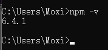

1) 安装 vue_mogu_admin 项目的依赖

进入vue_mogu_admin 文件夹内，使用下面命令进行安装

```bash
# 使用淘宝镜像源进行依赖安装，解决国内下载缓慢的问题(出现警告可以忽略)
npm install --registry=https://registry.npm.taobao.org

# 启动项目
npm run dev

#打包项目（在部署的时候才需要使用）
npm run build
```

强烈建议不要用直接使用 cnpm 安装，会有各种诡异的 bug，可以通过重新指定 registry 来解决 npm 安装速度慢的问题。若还是不行，可使用 [yarn](https://github.com/yarnpkg/yarn) 替代 `npm`。

Windows 用户若安装不成功，很大概率是`node-sass`安装失败，[解决方案](https://github.com/PanJiaChen/vue-element-admin/issues/24)。

另外因为 `node-sass` 是依赖 `python`环境的，如果你之前没有安装和配置过的话，需要自行查看一下相关安装教程。

 

在启动项目成功后，会跳转到：localhost:9528 ，我们输入账号密码： admin, mogu2018 访问即可


2) 安装 vue_mogu_web 项目的依赖,

这个步骤其实和admin端的安装时一致的，这里就不做过多的叙述

```bash
# 使用淘宝镜像源进行依赖安装，解决国内下载缓慢的问题(出现警告可以忽略)
npm install --registry=https://registry.npm.taobao.org

# 启动项目
npm run dev

#打包项目（在部署的时候才需要使用）
npm run build
```

 

下面是启动成功的界面，跳转到： localhost:9527


## 写在后面的话

关于我本机的配置，是使用的8G内存，项目所需的全部软件开启后，占用率大概到达了95%，所以微服务还是挺吃内存的。

关于服务器的配置，使用的是1核2G的学生价格服务器，目前来说，在增加虚拟内存后，能够正常的运行项目，内存不够的小伙伴，可以参考这篇博客。[CentOS如何增加虚拟内存？](http://www.moguit.cn/#/info?blogUid=36ee5efa56314807a9b6f1c1db508871)

好了，关于博客的配置就到这里了，如果有问题的话，欢迎提出~